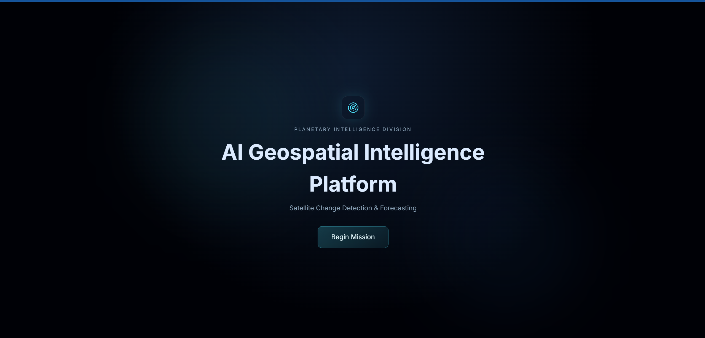
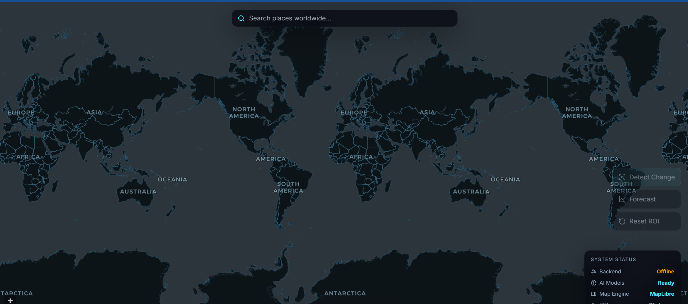
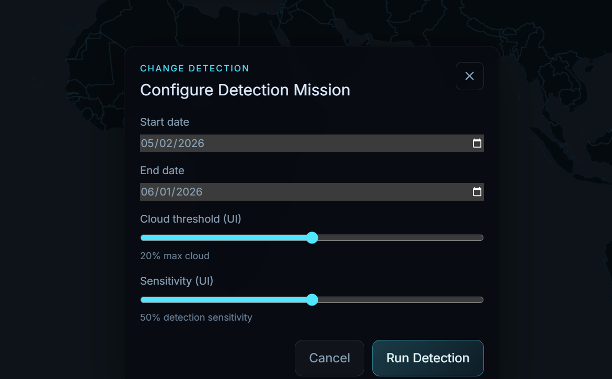
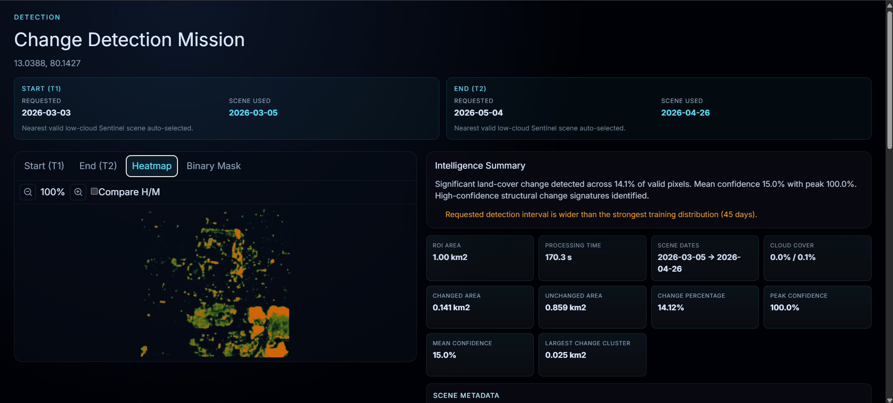
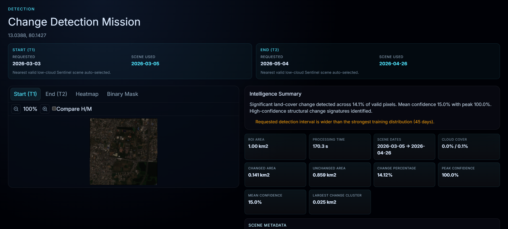
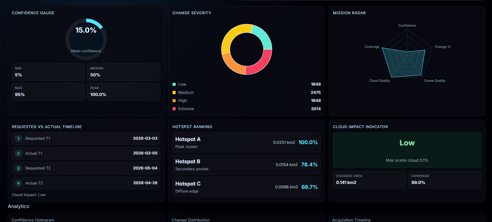
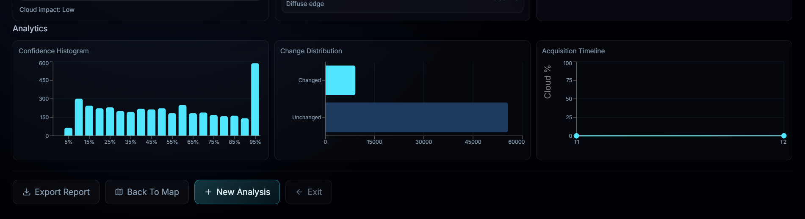
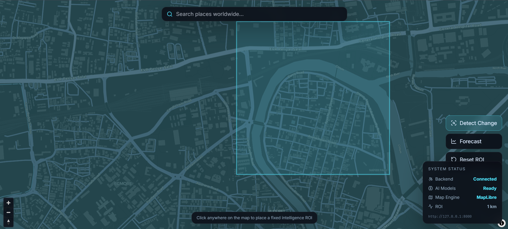

GeoChange — AI Satellite Change Detection & Forecasting System

GeoChange is an end-to-end geospatial AI system for detecting and forecasting changes in satellite imagery.

It combines Google Earth Engine, Sentinel-2 satellite imagery, deep learning models, FastAPI, and a React-based interactive dashboard.

What GeoChange Does

GeoChange provides two main capabilities:

1. Change Detection

Two satellite images of the same location at different dates are used to:

Detect areas that have changed
Generate a change map
Classify detected changes
Display confidence information
Visualize results through heatmaps and analytics
2. Future Change Forecasting

Three or more temporal observations can be used to generate a forecast of future spatial change using a ConvLSTM-based model.

System Architecture

User → React Frontend → FastAPI Backend → Google Earth Engine → Sentinel-2 Imagery → Preprocessing → Deep Learning Model → Results & Visualization

Main Technologies
Python
PyTorch
FastAPI
React
Vite
Google Earth Engine
Sentinel-2
Rasterio
NumPy
MapLibre
Recharts
Models
Change Detection Model

Siamese U-Net is used to compare two satellite observations and generate a spatial change representation.

Model file:

models/siamese_unet.pth

Forecasting Model

ConvLSTM is used for temporal forecasting from a sequence of satellite observations.

Model file:

models/convlstm.pth

Satellite Data

GeoChange uses Sentinel-2 Surface Reflectance imagery through Google Earth Engine.

The runtime system retrieves suitable imagery dynamically rather than requiring the complete satellite dataset to be stored inside this repository.

The training dataset is provided separately through Kaggle.

Repository Contents
backend/ — FastAPI backend and inference pipeline
frontend/ — React/Vite web application
models/ — trained model weights
configs/ — configuration files
src/ — supporting project source code
normalization_stats.json — normalization statistics used by inference
split_map.json — dataset location split information
locations_review.pdf — location review documentation
Requirements

Before running GeoChange locally, install:

Python
Node.js and npm
Git
A Google account
Google Earth Engine access
A Google Cloud / Earth Engine project
Installation
1. Clone the repository

Clone this repository and enter the project directory.

2. Create a Python virtual environment

Create and activate a Python virtual environment.

Python 3.10 or newer is recommended for the current project configuration.

3. Install backend dependencies

Install the dependencies listed in:

backend/requirements_backend.txt

4. Configure Google Earth Engine

GeoChange requires Google Earth Engine for live Sentinel-2 imagery acquisition.

You must use your own Google account and your own Earth Engine / Google Cloud project.

GeoChange does not provide or include the author's Google credentials.

Authenticate your own Earth Engine account according to the current Google Earth Engine documentation.

5. Configure the backend

Create:

backend/.env

using:

backend/.env.example

Set your own Earth Engine project ID:

EE_PROJECT_ID=YOUR_PROJECT_ID

Do not commit your .env file, credentials, private keys, or access tokens to GitHub.

Running the Backend

From the project root, start the FastAPI server using Uvicorn.

The backend runs locally on:

http://127.0.0.1:8000

Running the Frontend

Open another terminal and enter the frontend directory.

Install the Node.js dependencies and start the Vite development server.

The frontend normally runs on:

http://localhost:5173

Using GeoChange
Change Detection
Open the frontend.
Select a location.
Select the first observation date.
Select the second observation date.
Run Change Detection.
Review the satellite imagery, change map, heatmap, and analytics.
Forecasting
Select a location.
Provide the required temporal observations.
Run Forecast.
Review the predicted future change visualization.
Dataset

The training dataset is maintained separately from this GitHub repository.

The dataset contains satellite imagery organized for the GeoChange change-detection and forecasting experiments.

The GitHub repository contains the trained model weights and software required for inference.

Important: Earth Engine Credentials

This repository does not contain the author's Google account, Earth Engine credentials, service-account private keys, or access tokens.

If you clone this repository, configure GeoChange using your own Google Earth Engine project and credentials.

Limitations
Satellite imagery availability depends on Google Earth Engine and Sentinel-2 data availability.
Cloud and atmospheric conditions can affect satellite observations and model results.
Forecasting results are experimental predictions and should not be interpreted as guaranteed future events.
Runtime performance depends on the user's hardware, network connection, Earth Engine availability, and server configuration.
Reproducibility

To reproduce the project:

Clone this repository.
Install the required dependencies.
Configure your own Earth Engine project.
Authenticate your own Earth Engine account.
Configure backend/.env.
Start the FastAPI backend.
Start the React frontend.
Run detection or forecasting through the dashboard.
Project Purpose

GeoChange was developed as an academic Artificial Intelligence and Machine Learning project exploring the integration of:

Remote sensing
Geospatial AI
Deep learning
Temporal modelling
Satellite change detection
Future change forecasting
Interactive geospatial visualization
